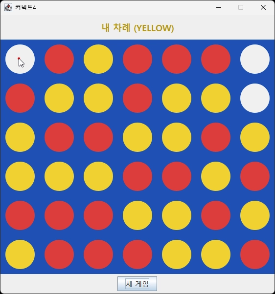

# 🎮 커넥트4 (Connect Four)

Java 기반으로 구현한 1인용 **커넥트4** 게임입니다.<br>
6×7 보드에서 가로·세로·대각선으로 먼저 4개를 연결하면 승리하는 보드게임입니다.


## 🎯 개발 목표

객체지향 설계 원칙과 디자인 패턴을 실제 프로젝트에 적용해보는 것을 목표로 진행했습니다.

- **추상화와 다형성** — `Player` 추상 클래스를 두어 사람과 AI를 동일한 인터페이스로 처리
- **디자인 패턴 적용** — 전략 패턴(Strategy Pattern)을 사용해 AI 난이도를 손쉽게 교체·확장할 수 있는 구조 설계
- **예외 처리 설계** — 커스텀 예외(`InvalidMoveException`)를 정의해 잘못된 입력을 명확히 분리
- **GUI 구현** — Java Swing을 활용한 이벤트 기반 그래픽 인터페이스 구현


## 🎮 주요 기능

- **사람 vs AI 대전** — 사용자가 AI와 1:1로 대전
- **난이도 선택** — 게임 시작 시 3단계(쉬움/보통/어려움) 난이도 선택
- **선공 선택** — 사람과 AI 중 누가 먼저 둘지 선택 가능
- **GUI 기반 조작** — 마우스 클릭으로 원하는 열에 말 떨어뜨리기
- **실시간 상태 표시** — 현재 차례, 승패 결과를 화면 상단에 표시
- **새 게임** — 게임 종료 후 버튼 클릭으로 난이도·선공 재선택하여 재시작

## 🛠️ 기술 스택

- **언어**: Java 21
- **GUI**: Swing
- **데이터 관리**: ArrayList
- **예외 처리**: 사용자 정의 예외 (`InvalidMoveException`)

## 📘 클래스 다이어그램

## 클래스 다이어그램
> 이미지 클릭 시 원본 크기로 볼 수 있습니다.

[](https://raw.githubusercontent.com/s1hyun7215/test/main/docs/connect-four.drawio.svg)


## 🏛️ 핵심 설계 (OOP)

객체지향 설계 원칙과 디자인 패턴을 적용해 **확장 가능하고 유지보수하기 좋은 구조**를 목표로 설계했습니다.

<br>

### 1. 전략 패턴 (Strategy Pattern)

AI의 난이도별 행동 방식을 `Strategy` 인터페이스로 추상화하고, 각 난이도를 별개의 구현 클래스로 분리했습니다.

```
Strategy (interface)
├── EasyStrategy     ← 랜덤 선택
├── MediumStrategy   ← 중앙 선호 + 승리수 착수 / 패배 방어
└── HardStrategy     ← Minimax + 휴리스틱 평가
```

`AIPlayer`는 어떤 전략을 사용하는지 알 필요 없이 `strategy.decideMove(board, piece)` 만 호출합니다.

```java
public class AIPlayer extends Player {
    private final Strategy strategy;

    public int decideMove(Board board) throws InvalidMoveException {
        return strategy.decideMove(board, piece);
    }
}
```

**이렇게 설계한 이유**
- 새로운 난이도(예: 매우 어려움)를 추가할 때 `Strategy` 인터페이스만 구현하면 됨
- 기존 코드 수정 없이 기능 확장 가능 (**OCP, 개방-폐쇄 원칙**)
- AIPlayer는 구체 클래스가 아닌 Strategy 인터페이스에 의존 (**DIP, 의존성 역전 원칙**)

<br>

### 2. 추상 클래스를 통한 플레이어 추상화

사람과 AI는 입력 방식이 전혀 다르지만(마우스 클릭 vs 알고리즘 계산), 게임 입장에서는 **"다음에 둘 열을 결정한다"** 라는 동일한 행동을 합니다. 이를 `Player` 추상 클래스로 묶었습니다.

```
Player (abstract)
├── HumanPlayer  ← 마우스 클릭으로 입력받은 열 반환
└── AIPlayer     ← Strategy를 통해 계산한 열 반환
```

```java
public abstract class Player {
    public abstract int decideMove(Board board) throws InvalidMoveException;
}
```

**이렇게 설계한 이유**
- `Game` 클래스는 현재 플레이어가 사람인지 AI인지 신경 쓸 필요 없음
- 게임 진행 로직이 `currentPlayer.decideMove(board)` 한 줄로 단순해짐
- Player는 "수를 결정한다"는 단일 책임만 가짐 (**SRP, 단일 책임 원칙**)

<br>

### 3. 다형성을 활용한 게임 로직 단순화

위 두 가지 설계 덕분에 `Game.playTurn()` 메서드가 매우 간결해졌습니다.

```java
public int playTurn() throws InvalidMoveException {
    // 사람이든 AI든, 쉬움이든 어려움이든 동일하게 처리
    int col = currentPlayer.decideMove(board);
    int row = board.dropPiece(col, currentPlayer.getPiece());
    
    if (board.checkWin(row, col)) { /* 승리 처리 */ }
    else if (board.isFull())       { /* 무승부 처리 */ }
    else                           { switchTurn(); }
    
    return row;
}
```

`Game`은 **누가 어떻게 수를 결정하는지** 전혀 모릅니다. 그저 `Player`에게 묻고, `Board`에 반영할 뿐입니다. 이러한 책임 분리 덕분에 각 클래스가 자기 역할에만 집중할 수 있습니다.

<br>

## 🚨 예외 처리 설계

게임 중 발생할 수 있는 **잘못된 수(Invalid Move)** 를 명확히 다루기 위해 사용자 정의 예외 `InvalidMoveException`을 정의했습니다.

### 예외 상황 및 처리 방식

#### 실제 발생 가능 예외

| 상황 | 처리 방식 |
|------|-----------|
| 사용자가 이미 가득 찬 열을 클릭한 경우 | `Board.dropPiece()`에서 예외 발생 → `GameFrame`이 `JOptionPane`으로 알림<br> → 게임 상태가 변경되지 않아 사용자가 다시 입력 가능 |

#### 방어적 예외 처리

정상적인 흐름에서는 발생하지 않지만, 호출 규약을 어긴 코드가 조용히 동작하지 않도록 명시적으로 예외를 발생시킵니다.

| 상황 | 발생 위치 |
|------|-----------|
| 잘못된 열 번호 (음수/범위 초과)로 호출 | `Board.dropPiece()` |
| `EMPTY` 말을 놓으려 할 때 | `Board.dropPiece()` |
| 사용자가 클릭 입력 없이 `decideMove()`가 호출된 경우 | `HumanPlayer.decideMove()` |
| AI가 둘 수 있는 열이 하나도 없는 상태에서 호출 | `Strategy.decideMove()` |


<br>

### 예외 처리 흐름

예외는 발생한 곳에서 바로 처리하지 않고, **상위 계층(`GameFrame`)까지 전파**되어 사용자에게 알림 다이얼로그로 표시됩니다.

```java
// GameFrame.java
private void playOneTurn() {
    try {
        game.playTurn();
        // ... 정상 처리
    } catch (InvalidMoveException e) {
        // 사용자에게 알림, 다시 입력받기
        JOptionPane.showMessageDialog(this, 
            e.getMessage(), "잘못된 수", JOptionPane.WARNING_MESSAGE);
    }
}
```

<br>

### 이렇게 설계한 이유

- **명확한 의미 전달** — `boolean` 반환값 대신 예외를 사용해 "정상 흐름이 아닌 비정상 상황"임을 명시
- **에러 메시지 일원화** — 어떤 종류의 잘못된 수든 `getMessage()`로 사용자에게 그대로 전달 가능
- **책임 분리** — `Board`와 `Player`는 예외를 **발생시키기만** 하고, UI 계층(`GameFrame`)이 **처리**를 담당
- **게임 진행 보호** — 예외가 발생해도 게임이 종료되지 않고, 사용자가 다시 입력할 수 있도록 복구
- **방어적 프로그래밍** — 실제로 발생하지 않을 상황에도 예외를 두어, 호출 규약을 어긴 코드가 조용히 동작하지 않도록 방지

<br>

## 🧩 트러블슈팅

### AI턴 진행 시 화면이 멈추는 문제

**증상**

AI 턴에서 사용자가 AI의 사고 시간을 인지할 수 있도록 600ms 딜레이를 주기 위해 `Thread.sleep(600)`을 사용했습니다. 그런데 실행해보니 의도와 정반대의 현상이 발생했습니다.

- 사용자가 말을 두면 빨강 말이 바로 화면에 나타나지 않음
- 화면이 600ms 동안 멈춰 있다가 갑자기 사용자 말과 AI 말이 동시에 나타남
- 사용자 입장에선 "내가 늦게 두고 AI가 즉시 둔 것"처럼 보이는 정반대의 효과

**원인 분석**

Java Swing은 모든 UI 갱신과 이벤트 처리를 **EDT(Event Dispatch Thread)** 라는 단일 스레드에서 처리합니다. `repaint()` 호출은 "즉시 다시 그리기"가 아니라 "EDT가 한가할 때 그려달라는 예약 요청"입니다. 그런데 바로 다음 줄에서 `Thread.sleep()`이 EDT를 점유하면, 예약된 그리기 작업이 sleep이 끝날 때까지 미뤄집니다.

```java
// 문제의 흐름
game.playTurn();          // 보드 데이터 변경
boardPanel.repaint();     // 다시 그리기 예약 (아직 안 그려짐)
Thread.sleep(600);        // ⚠️ EDT 점유 → 예약된 그리기 실행 불가
playOneTurn();            // AI가 둠 (또 다른 데이터 변경)
// → sleep 종료 후, 사용자 말과 AI 말이 한 프레임에 함께 그려짐
```

**해결**

`javax.swing.Timer`로 변경해 EDT를 차단하지 않고 비동기로 콜백이 실행되도록 했습니다.

```java
// 변경 후 (GameFrame.java)
private void triggerAITurnIfNeeded() {
    // ...
    Timer timer = new Timer(AI_DELAY_MS, e -> playOneTurn());
    timer.setRepeats(false);
    timer.start();
}
```

`Timer`는 지정된 시간이 지나면 **EDT에 콜백을 예약**하는 방식으로 동작합니다. Timer가 대기하는 동안 EDT가 한가하므로 그 사이에 예약된 `repaint()`가 정상적으로 실행되고, 600ms 후 AI 콜백이 실행됩니다. 

그 결과:

- 사용자 클릭 즉시 빨강 말이 화면에 나타남
- 600ms 후 AI가 노랑 말을 둠
- 사용자가 의도한 "AI 사고 시간" 효과가 정상적으로 동작

<br>

## 📦 컬렉션 프레임워크 사용

### `ArrayList<Integer>` — 유효한 열 목록 관리

AI가 수를 결정할 때, **현재 보드에서 둘 수 있는 열들의 목록**을 관리하는 데 사용했습니다.

```java
private List<Integer> getValidColumns(Board board) {
    List<Integer> valid = new ArrayList<>();
    for (int c = 0; c < Board.COLS; c++) {
        if (!board.isColumnFull(c)) {
            valid.add(c);
        }
    }
    return valid;
}
```

**`ArrayList`를 선택한 이유**

| 요구사항 | `ArrayList`가 적합한 이유 |
|----------|---------------------------|
| 둘 수 있는 열의 개수가 매 턴마다 달라짐 | 크기가 동적으로 변할 수 있는 자료구조 필요 |
| 순회하며 각 열을 평가 (이기는 수인지, 막는 수인지) | 순차 접근(`for-each`)이 빠름 |
| `HardStrategy`에서 최고점 동점 시 랜덤 선택 | 인덱스 접근(`get(i)`)이 O(1)로 빠름 |
| 중복된 열 번호는 들어가지 않음 (`Set`이 필요 없음) | `List`로 충분 |

`LinkedList`나 `HashSet` 대신 `ArrayList`를 택한 이유는 **빈번한 인덱스 접근과 순회가 핵심 작업**이기 때문입니다. 삽입/삭제가 거의 일어나지 않으므로 `ArrayList`의 O(1) 인덱스 접근이 가장 효율적입니다.

<br>

### 보드 데이터는 왜 컬렉션을 쓰지 않았나

보드는 **고정 크기(6×7)** 이고, **2차원 좌표로 빠른 접근**이 필요하므로 `Piece[][]` 2차원 배열을 사용했습니다. 

```java
private final Piece[][] grid;   // 6×7 고정 크기

public Piece getCell(int row, int col) {
    return grid[row][col];   // O(1) 접근
}
```

크기가 변하지 않고 인덱스 접근이 주된 작업이므로 컬렉션보다 **원시타입 배열이 더 적합**하다고 판단했습니다.

<br>

## 🖥️ 실행 화면

### 1. 게임 시작
>게임 시작 시 **AI 난이도**(쉬움/보통/어려움)와 **선공**(사람/AI)을 선택할 수 있으며, 게임 종료 후 **"새 게임"** 버튼으로 처음부터 다시 시작할 수 있습니다.

<table>
  <tr>
    <td align="center"><b>난이도 / 선공 선택 / 게임 진행 / 새 게임</b></td>
  </tr>
  <tr>
    <td></td>
  </tr>
</table>

<br>

### 2. 게임 결과
>가로·세로·대각선으로 먼저 4개를 연결한 쪽이 승리합니다.

<table>
  <tr>
    <td align="center"><b>사람 승리</b></td>
    <td align="center"><b>AI 승리</b></td>
  </tr>
  <tr>
    <td></td>
    <td></td>
  </tr>
</table>


<br>

### 3. 무승부 및 예외 처리
>6×7 보드가 모두 채워질 때까지 승부가 나지 않으면 무승부로 처리됩니다. <br>
>가득 찬 열을 클릭하는 등 잘못된 입력 시 알림 다이얼로그로 안내하며, 사용자는 다시 입력할 수 있습니다.

<table>
  <tr>
    <td align="center"><b>무승부</b></td>
    <td align="center"><b>잘못된 수 입력</b></td>
  </tr>
  <tr>
    <td></td>
    <td></td>
  </tr>
</table>

